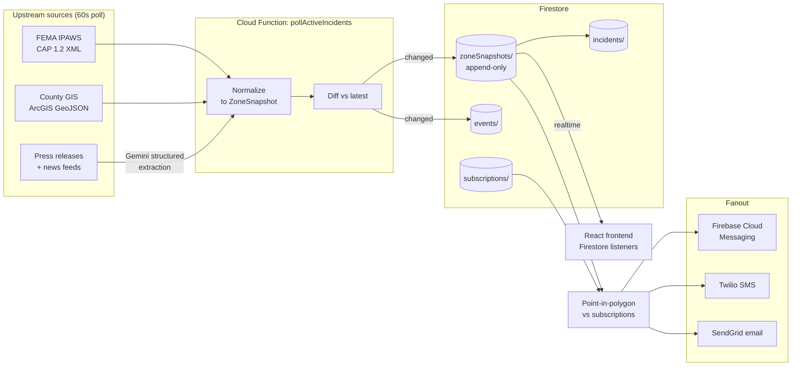

# HazAlert — Production Architecture

This document describes the production architecture HazAlert is migrating
toward. The MVP shipped for the hackathon uses a single hardcoded
incident; the design below is generic across hazard types and supports
real-time updates, time-series replay, and multi-channel notifications.

## System Diagram



## Data Flow

1. **Ingestion (every 60s).** Cloud Scheduler triggers a Cloud Function
   that iterates every active incident. For each one it pulls fresh
   state from IPAWS, the relevant county GIS layer, and any new
   news/press-release content. News goes through a Gemini structured-
   output prompt to extract incident fields.

2. **Normalization.** Each source's native format (CAP XML, GeoJSON,
   unstructured text) is mapped to the shared `ZoneSnapshot` shape
   defined in [src/types/incident.ts](../src/types/incident.ts).

3. **Diff.** The candidate snapshot is compared against the most recent
   stored snapshot for that incident. No changes → exit early. Changes
   → write a new snapshot and an accompanying `zone_change` event.

4. **Persistence.** Snapshots are **append-only** — old snapshots are
   never overwritten. The parent `incidents/{id}` document holds a
   `currentSnapshotId` pointer updated transactionally with each new
   write.

5. **Real-time push.** Frontend clients subscribe via Firestore real-
   time listeners on `incidents/{id}` and its `zoneSnapshots`
   subcollection. Zone changes propagate to every connected browser in
   sub-second time, with no polling.

6. **User fanout.** After persisting, the scheduler runs point-in-
   polygon against every subscription tracking this incident. Users
   whose zone level changed (e.g. `watch` → `mandatory`) get
   notifications on every channel they opted into.

## Why Firestore for time-series snapshots?

Most time-series systems (Bigtable, InfluxDB, TimescaleDB) optimize for
high-cardinality numeric writes. HazAlert's "time series" is different:
**low frequency** (a snapshot every few minutes per incident, at most),
**rich payload** (GeoJSON polygons + guidance + metadata), and
**real-time fanout** to many readers. Firestore is the right fit because:

- Native realtime listeners on collections give us push-to-client for
  free, with no separate websocket layer to operate.
- Subcollections naturally model the parent/child relationship
  (`incidents/{id}/zoneSnapshots/{snapshotId}`) and let us authorize
  per-incident reads with a single rule.
- Atomic transactions handle the "write new snapshot + bump
  currentSnapshotId pointer" pair safely.
- Cost is favorable at our access pattern (few writes, many reads).

When per-incident snapshot count grows past Firestore's practical
subcollection limit (low millions), we roll older snapshots into a
BigQuery archive table indexed by `(incidentId, timestamp)` for
analytics and after-action reports.

## Real-time updates reaching the frontend

```
Cloud Function writes new ZoneSnapshot
        │
        ▼
Firestore replicates to edge
        │
        ├──► Browser A (Garden Grove resident) — Firestore SDK fires onSnapshot;
        │       React state updates, map re-renders with new polygon.
        │
        └──► Browser B (out-of-area family member) — same listener, same update.
```

No polling, no manual cache invalidation. The frontend already holds an
open listener, so the new snapshot lands as a state delta within ~500ms.

## Notification flow

For each user subscription tracking an incident:

```
new ZoneSnapshot
    └──► point-in-polygon(sub.lat, sub.lng, snapshot.zones) -> newLevel
            └──► if newLevel != sub.lastKnownZoneLevel:
                    ├──► sendWebPush  (FCM)   if 'web_push' in channels
                    ├──► sendSms      (Twilio) if 'sms'      in channels
                    └──► sendEmail    (SendGrid) if 'email'  in channels
                    update sub.lastKnownZoneLevel
                    update sub.lastNotifiedAt
```

Critical transitions (anything → `mandatory`) bypass the 5-minute rate
limit and additionally trigger an automated Twilio voice call.

## File layout

| Path | Role |
| --- | --- |
| [src/types/incident.ts](../src/types/incident.ts) | Shared types: `Incident`, `ZoneSnapshot`, `IncidentEvent`, `UserSubscription` |
| [src/server/incidents/router.ts](../src/server/incidents/router.ts) | Express router: `/api/incidents`, `/near`, `/:id`, `/:id/snapshots`, `/:id/events` |
| [src/server/ingestion/sources.ts](../src/server/ingestion/sources.ts) | Adapters for IPAWS, county GIS, Gemini news extraction, snapshot diffing |
| [src/server/ingestion/scheduler.ts](../src/server/ingestion/scheduler.ts) | 60-second polling loop and fanout |
| [src/server/storage/firestore.ts](../src/server/storage/firestore.ts) | Typed Firestore wrapper (incidents, snapshots, events, subscriptions) |
| [src/server/notifications/dispatcher.ts](../src/server/notifications/dispatcher.ts) | Per-channel notification senders (FCM, Twilio, SendGrid) |
